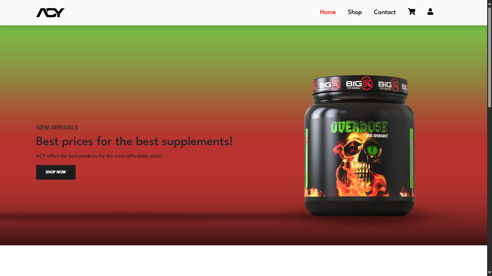
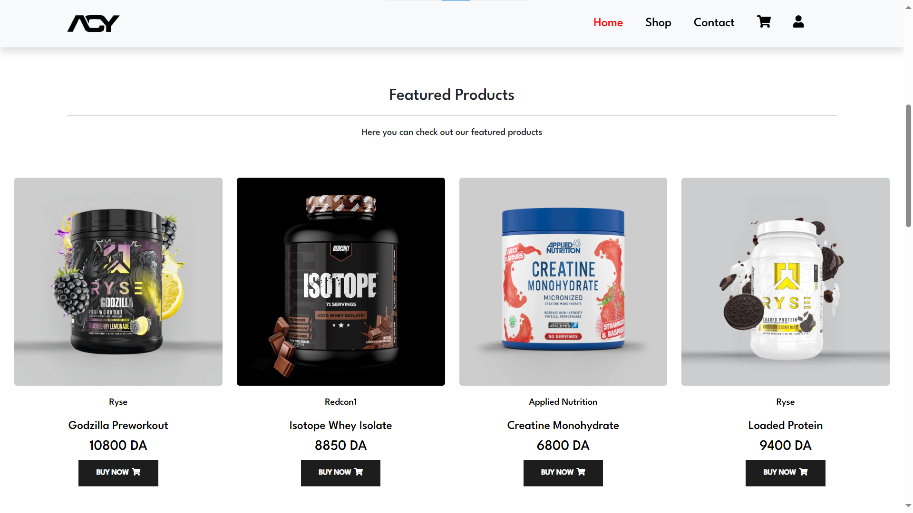
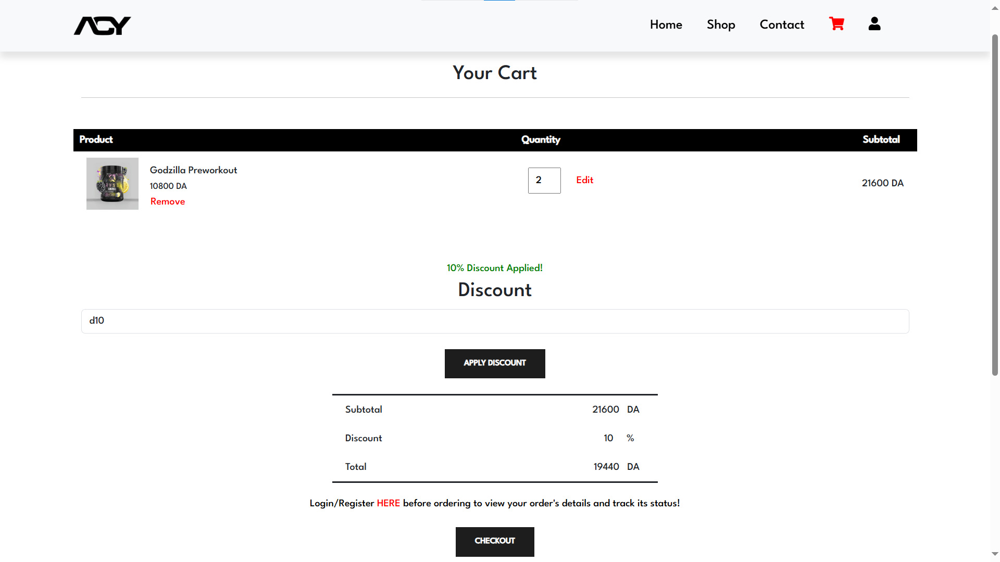
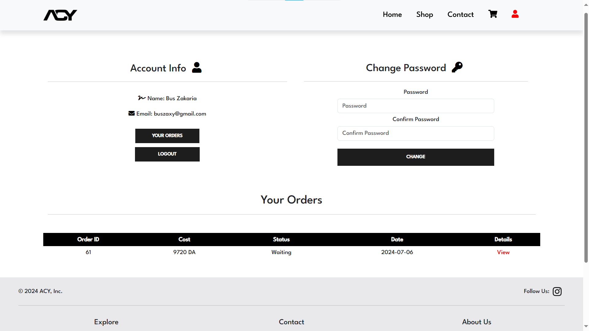
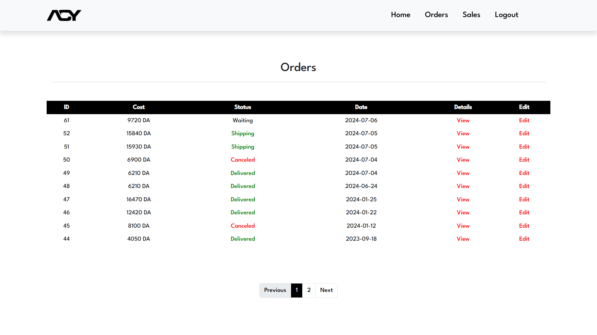
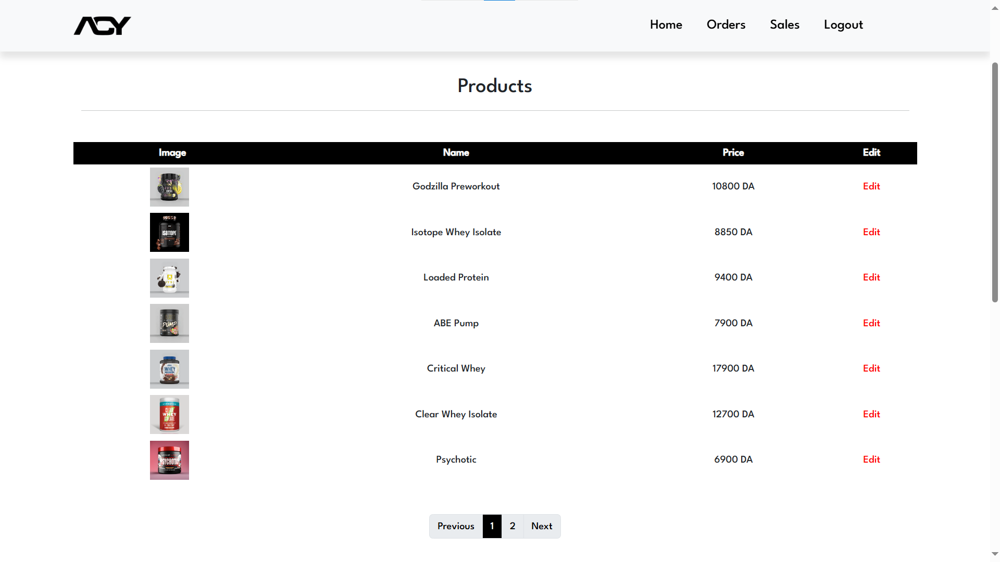

## Overview

Welcome to ACY Supplements Store, an Ecommerce platform built using PHP and Bootstrap. This repository is for a web application that offers a comprehensive solution for managing and selling gym supplements online.

  
  
  
  
  
  

## Features

### Customer-Facing Features:
* Home Page: displays featured products and best-selling categories.
* Shop Page: lists all available products with filtering options.
* Cart: allows customers to view added products, apply discounts, and proceed to checkout.
* Contact Page: provides contact information for customer inquiries.
* Account Page: enables customers to register, login, manage their account, and view order details.

### Admin Features (Dashboard):
* Manage orders, products, discount codes, product categories, clients.
* View statistics and insights about the store's performance.

## Link:

* Secure (HTTPS): [here](https://acysupps.shop/)

## Source Code

Unfortunately, this project was done for a client, so I cannot make the source code publicly available.